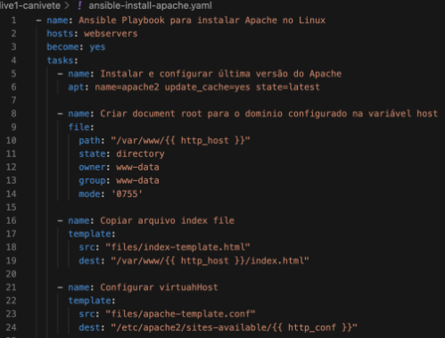
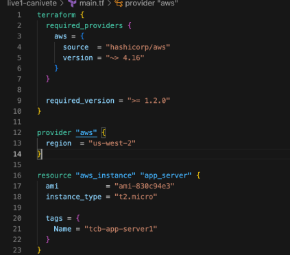
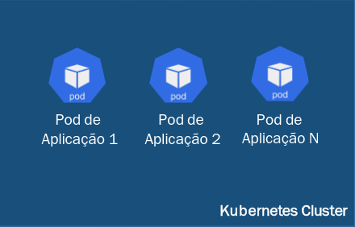

## Clod vs Multicloud

A nuvem (cloud) é um termo utilizado para se referir a recursos de computação, armazenamento e serviços disponíveis pela internet. Em vez de executar aplicativos ou armazenar dados localmente em um computador pessoal ou servidor local, você pode acessar e utilizar esses recursos remotamente por meio da internet.

A computação em nuvem permite que você aproveite a escalabilidade, flexibilidade e disponibilidade dos recursos de computação, sem a necessidade de investir em infraestrutura física. Você pode alugar recursos de computação, como servidores virtuais, armazenamento e bancos de dados, de provedores de serviços em nuvem, como a Amazon Web Services (AWS), Microsoft Azure, Oracle Cloud e Google Cloud Platform.

A multicloud, por sua vez, refere-se ao uso de múltiplos provedores de serviços em nuvem para atender às necessidades de uma organização. Em vez de depender exclusivamente de um único provedor de serviços em nuvem, uma empresa pode optar por utilizar diferentes provedores para diferentes cargas de trabalho ou para aproveitar os recursos específicos oferecidos por cada provedor.

A abordagem multicloud pode trazer benefícios como redundância e flexibilidade. Por exemplo, se um provedor de serviços em nuvem enfrentar uma interrupção, você ainda terá outros provedores disponíveis para manter seus serviços em funcionamento. Além disso, você pode escolher provedores específicos para aproveitar recursos especializados ou obter melhores preços em determinados serviços.

Certo, entendido esse resumo sobre Cloud, é preciso entender como de fato o Cloud funciona, como se comunica,quais suas ferramentas.

## Um pouco mais sobre os Serviços de Cloud:

    # Serviços
        - AWS
        - Microsoft Azure
        - Google Cloud
        - Oracle Cloud

    # Ferramentas Devops
        - Ansible
        - Terraform
        - Kubernetes
        - Docker

### Serviços

    
<b>Google Cloud</b>

    <ul>
        <li>
        Compute Engine 
        Máquinas virtuais em execução nos data centers do Google.
        </li>
        <li>
        Compute Engine 
        Máquinas virtuais em execução nos data centers do Google.
        </li>
        <li>
        Cloud Storage 
        Armazenamento de objetos seguro, durável e escalonável.
        </li>
        <li>
        BigQuery 
        Data warehouse para agilidade e insights comerciais.
        </li>
        <li>
        Cloud Run 
        Ambiente totalmente gerenciado para executar aplicativos em contêineres.
        </li>
        <li>
        Vertex AI 
        Plataforma unificada para modelos de ML e IA generativa.
        </li>
        <li>
        Looker 
        Plataforma para BI, aplicativos de dados e análise incorporada.
        </li>
        <li>
        Gerenciamento de APIs da Apigee 
        Gerencie de qualquer lugar todo o ciclo de vida das APIs com visibilidade e controle.
        </li>
        <li>
        Cloud SQL 
        Serviços de banco de dados relacional para MySQL, PostgreSQL e SQL Server.
        </li>
        <li>
        Gemini para o Google Cloud 
        Nova geração de assistentes de IA para desenvolvedores, serviços do Google Cloud e
        aplicativos.
        </li>
        <li>
        Cloud CDN 
        Rede de fornecimento de conteúdo para veicular Web e vídeo.
        </li>
        <li>
        Cloud Functions 
        Plataforma de computação orientada por eventos que é para serviços e apps na nuvem.
        </li>
     </ul>

    
<b>Microsoft Azure</b>

    <ul>
        <li>
        App Service 
        Quickly create powerful cloud apps for web and mobile
        </li>
        <li>
        Azure AI services 
        Build cutting-edge, market-ready, responsible applications for your organization with AI
        </li>
        <li>
        Azure Arc 
        Bring Azure services and management to any infrastructure
        </li>
        <li>
        Azure Cosmos DB 
        Fast NoSQL database with open APIs for any scale
        </li>
        <li>
        Azure Functions 
        Process events with serverless code
        </li>
        <li>
        Azure Kubernetes Service (AKS) 
        Simplify the deployment, management, and operations of Kubernetes
        </li> 
        <li>
        Azure Operator Insights 
        Analyze network data from multiple sources
        </li> 
        <li>
        Azure Quantum (Preview) 
        Experience quantum impact today on Azure
        </li> 
        <li>
        Azure SQL 
        Modern SQL family for migration and app modernization
        </li> 
        <li>
        Azure Virtual Desktop 
        The best virtual desktop experience, delivered on Azure
        </li> 
        <li>
        Microsoft Copilot in Azure (Preview) 
        Simplify operations and management from cloud to edge with an AI companion
        </li> 
        <li>
        Virtual Machines 
        Provision virtual machines for Ubuntu, Red Hat, Windows, and more
        </li>         
    </ul>

    
<b>AWS</b>

    <ul>
        <li>
        Amazon EC2 
        Crie e execute servidores virtuais na nuvem
        </li>
        <li>    
        Amazon S3 
        Armazenamento de objetos criado para recuperar qualquer quantidade de dados de qualquer lugar
        </li>
        <li>       
        Amazon DynamoDB 
        Serviço de banco de dados NoSQL gerenciado
        </li>
        <li>     
        Amazon RDS 
        Configure, opere e ajuste a escala de um banco de dados relacional na nuvem
        </li>
        <li>     
        AWS Lambda 
        Execute código sem pensar em servidores
        </li>
        <li>     
        Amazon VPC 
        Isolated cloud Recursos de nuvem isolada
        </li> 
        <li>     
        Choosing a generative AI service 
        Determine quais serviços de IA generativa da AWS são mais adequados para sua organização
        </li> 
        <li>     
        Escolhendo um serviço de contêiner da AWS? 
        Avalie os serviços de contêiner da AWS para o desenvolvimento de aplicações modernas
        </li> 
        <li>     
        Amazon Bedrock ou Amazon SageMaker? 
        Determine qual serviço é mais adequado às suas necessidades
        </li> 
    </ul>

### Ferramentas Devops

## **Ansible** 
é uma ferramenta de automação de código aberto que é usada para gerenciamento de configuração de ambientes, implantação de aplicativos e orquestração. Ele permite automatizar tarefas repetitivas, gerenciar infraestrutura como código e simplificar a implantação e o gerenciamento de aplicativos em vários servidores ou ambientes de nuvem.

Com o Ansible, você pode definir configurações de infra e aplicativos em arquivos YAML simples e legíveis por humanos chamados de **playbooks**. Esses playbooks descrevem o estado desejado de seus sistemas e aplicativos, e o Ansible se encarrega de executar as tarefas necessárias para alcançar esse estado.

O Ansible utiliza uma arquitetura cliente-servidor, onde a máquina de controle (onde o Ansible está instalado) se comunica com os nós gerenciados (servidores ou instâncias de nuvem) por meio de SSH ou outros protocolos remotos. Ele usa um modelo de push, facilitando o gerenciamento de infraestrutura em grande escala e garantindo consistência no ambiente.

Algumas das principais características do Ansible incluem execução idempotente (significa que executar o mesmo playbook várias vezes sempre resultará no mesmo estado), facilidade de extensibilidade por meio de módulos e plugins, e uma comunidade grande e ativa que contribui para seu desenvolvimento e fornece suporte.

## **Terraform**
Terraform é uma ferramenta de infra como código (IaC) que permite provisionar e gerenciar recursos de infraestrutura em vários provedores de nuvem de forma automatizada. Em termos simples, é como se você estivesse escrevendo um "plano" para criar e configurar sua infraestrutura usando código.

 **Código IaC**:

    A Infraestrutura como Código (IaC) é uma abordagem para provisionar e gerenciar recursos de infraestrutura usando código. Em vez de configurar manualmente servidores, redes, bancos de dados e outros componentes de infraestrutura, você descreve sua infraestrutura desejada em um arquivo de configuração.   

Você pode descrever sua infraestrutura desejada em um arquivo de configuração chamado de **"arquivo de configuração do Terraform"** ou **"arquivo de manifesto"**. Nesse arquivo, você especifica os recursos que deseja criar, como servidores, redes, bancos de dados, etc., e também suas configurações, como tamanho, localização, etc.

Com o Manifesto pronto, você pode executar o Terraform para criar e gerenciar sua infraestrutura. O Terraform compara o estado atual da infraestrutura com o estado desejado descrito no Manifesto, e toma as ações necessárias para alcançar esse estado desejado. Isso pode incluir a criação, atualização ou exclusão de recursos.

Uma das principais vantagens do Terraform é que ele é agnóstico em relação aos provedores de nuvem. Isso significa que você pode usar o mesmo arquivo de configuração para provisionar recursos em diferentes provedores de nuvem, como AWS, Azure, Google Cloud, entre outros. Isso torna o Terraform uma ferramenta poderosa para gerenciar infraestruturas multi-cloud ou híbridas.

### **Kubernetes**
Kubernetes é uma plataforma de orquestração de contêineres que permite gerenciar e escalar aplicativos em um ambiente de nuvem. 

Vamos usar uma analogia para entender melhor. Imagine que você é o gerente de uma grande empresa e precisa coordenar várias equipes para realizar diferentes tarefas. Cada equipe é responsável por uma parte específica do trabalho, como desenvolvimento, teste, implantação e monitoramento. 

Da mesma forma, o Kubernetes atua como um gerente para seus contêineres. Os contêineres são unidades isoladas de software que contêm todos os componentes necessários para executar um aplicativo, como código, bibliotecas e dependências. 

Com o Kubernetes, você pode definir como deseja que seus contêineres sejam executados e o Kubernetes cuidará de todo o trabalho pesado para garantir que eles estejam em execução e funcionando corretamente. Ele pode lidar com tarefas como escalonamento automático, balanceamento de carga, recuperação de falhas e distribuição de tráfego entre os contêineres.

**Escalonamento e Load Balance**

    O escalonamento refere-se à capacidade do Kubernetes de ajustar automaticamente o número de réplicas de um determinado contêiner com base na demanda de recursos. Por exemplo, se houver um aumento repentino no tráfego para um aplicativo, o Kubernetes pode adicionar mais réplicas do contêiner para lidar com a demanda adicional. Da mesma forma, se a carga diminuir, o Kubernetes pode reduzir o número de réplicas para economizar recursos.

    O balanceamento de carga refere-se à distribuição equilibrada do tráfego entre as réplicas de um determinado contêiner. Quando há várias réplicas de um contêiner em execução, o Kubernetes pode distribuir o tráfego de entrada de forma equilibrada entre essas réplicas. Isso é feito para evitar sobrecarregar uma única instância do contêiner e garantir que todas as réplicas estejam sendo utilizadas de forma eficiente. 

Além disso, o Kubernetes fornece uma interface de linha de comando (CLI) e uma interface gráfica do usuário (GUI) para gerenciar e monitorar seus aplicativos. Ele também oferece recursos avançados, como implantação de aplicativos em vários nós de um cluster, atualizações de aplicativos sem tempo de inatividade e gerenciamento de segredos e configurações.

### **Docker**
O Docker é uma plataforma de virtualização de contêineres que permite empacotar e distribuir aplicativos juntamente com suas dependências em um formato chamado de contêiner.

Imagine que você está preparando um bolo e precisa de vários ingredientes, como farinha, ovos, açúcar e manteiga. O Docker é como uma caixa que você pode usar para empacotar todos esses ingredientes juntos, de forma que você possa compartilhar essa caixa com outras pessoas. Quando alguém recebe essa caixa, ela terá todos os ingredientes necessários para fazer o bolo, sem precisar se preocupar em comprar cada ingrediente separadamente.

Da mesma forma, o Docker permite que você empacote seu aplicativo juntamente com todas as bibliotecas e dependências necessárias em um contêiner. Isso torna mais fácil compartilhar e implantar seu aplicativo em diferentes ambientes, como servidores de desenvolvimento, servidores de produção ou até mesmo em nuvem.

O Docker resolve alguns problemas comuns no desenvolvimento de software, como inconsistências de ambiente, dependências conflitantes e dificuldades na implantação de aplicativos. Com o Docker, você pode garantir que seu aplicativo seja executado de maneira consistente em qualquer ambiente, independentemente das configurações do sistema operacional ou das bibliotecas instaladas.

Além disso, o Docker permite que você dimensione seus aplicativos de forma eficiente, executando várias instâncias do mesmo contêiner em um único servidor ou distribuindo-os em vários servidores. Isso facilita a escalabilidade e o gerenciamento de aplicativos em grande escala.

Este pequeno artigo foi uma Síntese dos principais agentes do Cloud, vai muito mais alem disto, contudo já é um avanço entender seus serviços e ferramentas